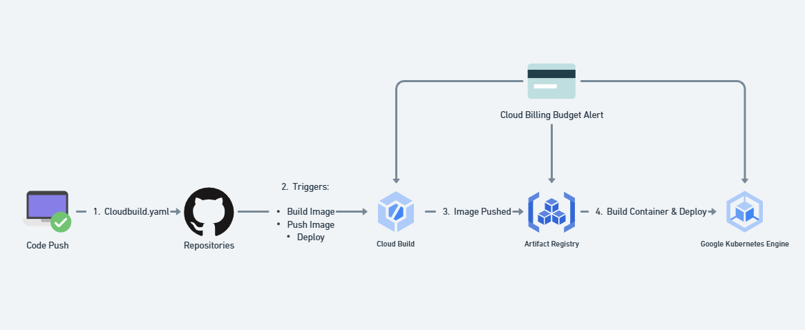
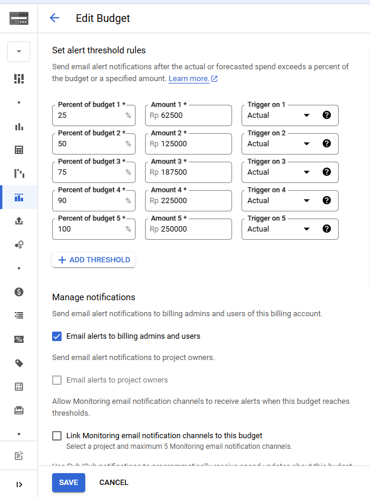
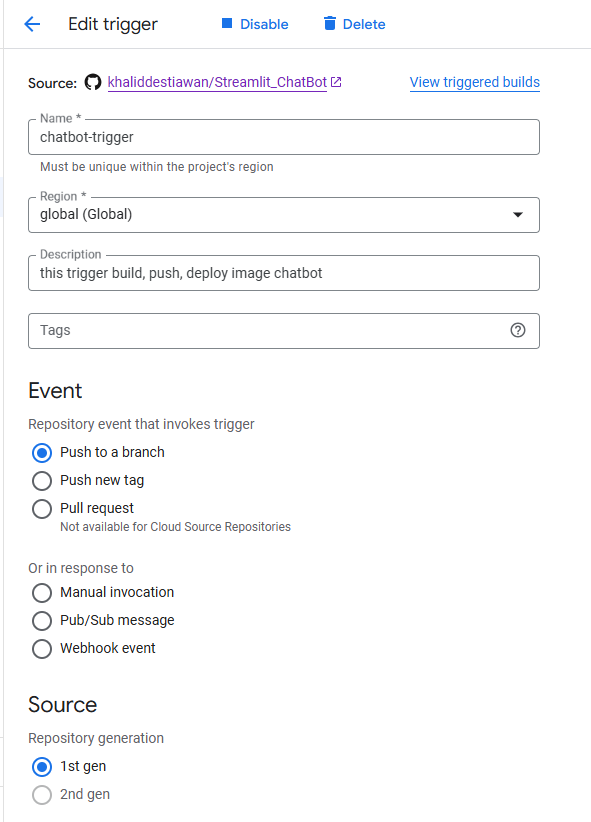
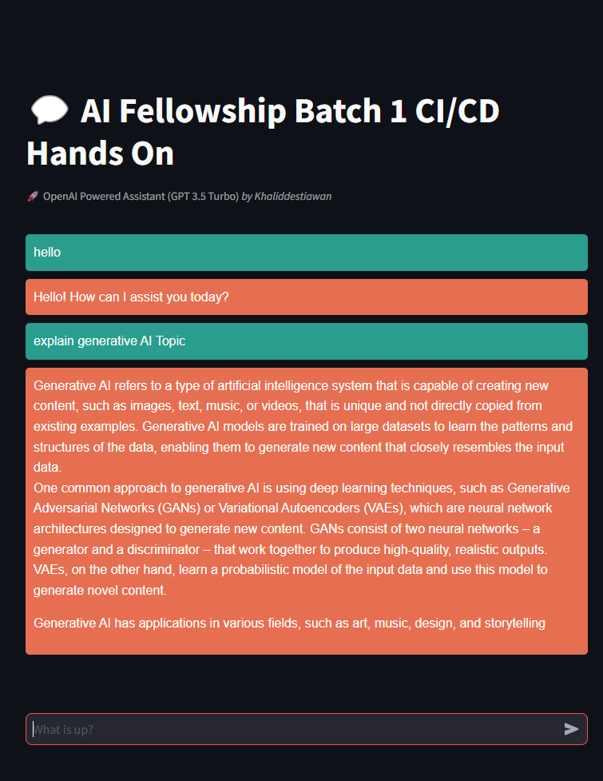

# GPT 3.5 Turbo Assistant

# 🚀 CI/CD Pipeline with Google Cloud Build, GCR, and GKE

## 🎯 Project Objective

This project implements a CI/CD pipeline utilizing **Google Cloud Build**, **Google Container Registry (GCR)**, and **Google Kubernetes Engine (GKE)**. The objective is to automate the build and deployment process of applications, ensuring a seamless and efficient workflow from code commit to production.

### 🌟 Key Features

- **Continuous Integration/Continuous Deployment (CI/CD)**: Automate the build, test, and deployment processes.
- **Google Cloud Build**: Manage builds triggered by code changes effortlessly.
- **Google Container Registry (GCR)**: Store Docker images securely for easy access during deployments.
- **Google Kubernetes Engine (GKE)**: Deploy applications on a scalable Kubernetes cluster.
- **Budget Alerts**: A GCP budget alert has been set up to monitor costs associated with the applications, ensuring financial oversight and management. 📊

## 🖼️ Architecture Diagram



## 📸

### 💰 Budget Alert

 


### 🔄 Trigger Build


 


### 🖥️ Application Snapshot





## 🚀 Getting Started

### 📋 Prerequisites

- Google Cloud Platform (GCP) account.
- Google Cloud SDK installed.
- A GKE cluster set up.
- Billing enabled on your GCP project.

### 🛠️ Setup Instructions

1. **Create a GKE Cluster**:
   ```bash
   gcloud container clusters create your-cluster-name --zone your-zone